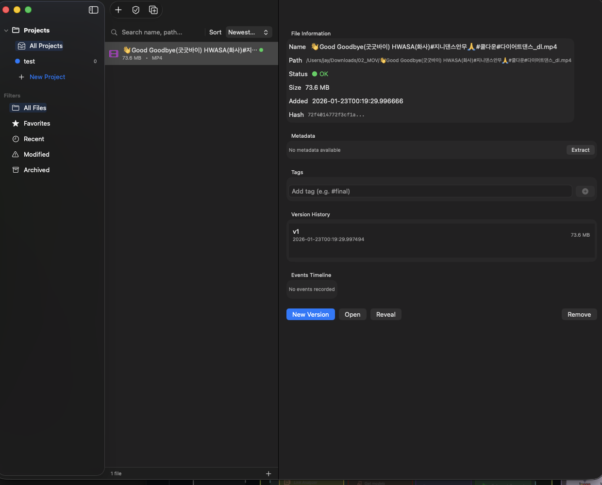

# VersionManager

macOS용 파일 버전 관리 앱입니다. 중요한 파일의 변경 사항을 추적하고, 버전을 백업하며, 필요할 때 이전 버전으로 복원할 수 있습니다.



## 주요 기능

### 파일 버전 관리
- **버전 자동 백업**: 파일 등록 시 자동으로 첫 번째 버전 생성
- **새 버전 생성**: 파일 변경 후 언제든지 새 버전 저장
- **버전 복원**: 이전 버전으로 원클릭 복원
- **버전 고정(Pin)**: 중요한 버전을 별도 폴더에 보관

### 파일 상태 추적
- **해시 기반 검증**: SHA256 해시로 파일 무결성 확인
- **상태 표시**: OK / Modified / Missing 상태 실시간 표시
- **일괄 검증**: 모든 파일 상태 한 번에 확인

### 프로젝트 관리
- **프로젝트 분류**: 파일을 프로젝트별로 그룹화
- **색상 구분**: 프로젝트별 색상 지정
- **필터링**: 전체, 즐겨찾기, 최근, 수정됨, 보관됨 필터

### 메타데이터 & 태그
- **이미지/비디오 메타데이터** 자동 추출
- **태그 시스템**: 파일에 태그 추가하여 분류
- **검색**: 파일명, 경로, 태그로 검색

## 시스템 요구사항

- macOS 14.0 (Sonoma) 이상
- Apple Silicon 또는 Intel Mac

## 설치 방법

### 소스에서 빌드

```bash
# 저장소 클론
git clone https://github.com/dit-jay93/VersionManager.git
cd VersionManager

# Xcode로 프로젝트 열기
open swift-ui/VersionManager.xcodeproj

# Xcode에서 빌드 (Cmd + B)
```

## 사용 방법

### 파일 등록
1. 툴바의 `+` 버튼 클릭 또는 `Cmd + O`
2. 추적할 파일 선택
3. 커밋 메시지 입력

### 새 버전 생성
1. 파일 목록에서 파일 선택
2. `New Version` 버튼 클릭
3. 변경 사항 설명 입력

### 버전 복원
1. 파일 선택 후 Version History에서 버전 선택
2. 컨텍스트 메뉴에서 `Restore` 선택

### 프로젝트 생성
1. 사이드바의 `+ New Project` 클릭
2. 프로젝트 이름과 색상 설정
3. 파일을 프로젝트로 드래그 또는 컨텍스트 메뉴로 이동

## 기술 스택

- **언어**: Swift 5
- **UI 프레임워크**: SwiftUI
- **데이터 저장**: SwiftData
- **해시 알고리즘**: SHA256 (CryptoKit)

## 프로젝트 구조

```
swift-ui/VersionManager/
├── Models/
│   └── DataModels.swift      # SwiftData 모델 정의
├── Services/
│   ├── FileService.swift     # 파일/버전 관리 로직
│   └── LocalAppState.swift   # 앱 상태 관리
├── Views/
│   └── LocalContentView.swift # UI 컴포넌트
├── Assets.xcassets/          # 앱 아이콘, 색상
└── VersionManagerApp.swift   # 앱 진입점
```

## 데이터 저장 위치

- **데이터베이스**: `~/Library/Application Support/VersionManager/`
- **버전 백업**: `~/Library/Application Support/VersionManager/versions/`
- **고정된 버전**: `~/Library/Application Support/VersionManager/pinned/`

## 라이선스

MIT License

## 기여

이슈 리포트와 풀 리퀘스트를 환영합니다.

---

Made with SwiftUI
